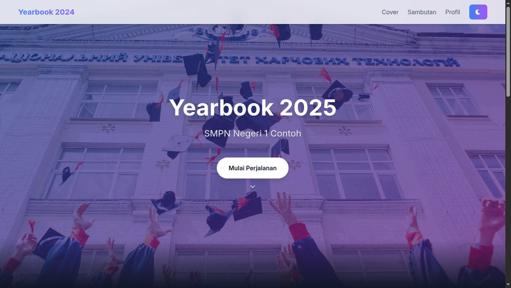

# Yearbook Digital 2025

<div align="center">
  
  
  [](https://opensource.org/licenses/MIT)
  [](https://github.com/username/yearbook-2024)
</div>

## 📑 Daftar Isi

- [Yearbook Digital 2025](#yearbook-digital-2025)
  - [📑 Daftar Isi](#-daftar-isi)
  - [📝 Deskripsi](#-deskripsi)
  - [✨ Fitur Utama](#-fitur-utama)
  - [🎥 Demo](#-demo)
  - [🚀 Cara Menggunakan](#-cara-menggunakan)
    - [Instalasi](#instalasi)
    - [Navigasi](#navigasi)
  - [👥 Membuat Profil](#-membuat-profil)
    - [Template Profil](#template-profil)
      - [Profil Guru](#profil-guru)
      - [Profil Siswa](#profil-siswa)
    - [Panduan Pengisian](#panduan-pengisian)
  - [📋 Persyaratan](#-persyaratan)
  - [📁 Struktur Proyek](#-struktur-proyek)
  - [🛠️ Teknologi](#️-teknologi)
  - [🤝 Kontribusi](#-kontribusi)
  - [🆘 Bantuan](#-bantuan)
    - [Melaporkan Bug](#melaporkan-bug)
  - [📄 Lisensi](#-lisensi)
  - [🙏 Credits](#-credits)

## 📝 Deskripsi

Yearbook Digital 2025 adalah aplikasi web modern yang dirancang untuk menampilkan kenangan dan profil siswa serta guru dalam format digital yang interaktif dan menarik. Aplikasi ini menggabungkan desain minimalis dengan fungsionalitas yang lengkap, menciptakan pengalaman yang menyenangkan untuk melihat kembali momen-momen berharga di sekolah.

## ✨ Fitur Utama

- **Desain Responsif**: Tampilan yang optimal di semua perangkat (desktop, tablet, mobile)
- **Mode Gelap/Terang**: Dukungan tema gelap dan terang yang dapat disesuaikan
- **Navigasi Smooth Scroll**: Transisi halus antar bagian
- **Pencarian Real-time**: Fitur pencarian instan untuk menemukan profil
- **Filter Kategori**: Filter untuk guru dan siswa
- **Profil Interaktif**: Kartu profil dengan animasi dan efek hover
- **Integrasi Media Sosial**: Tautan langsung ke media sosial profil
- **Optimasi Gambar**: Gambar yang dioptimalkan untuk performa cepat
- **Penyimpanan Lokal**: Menyimpan preferensi tema pengguna

## 🎥 Demo

[Link Demo](https://aqid191161.github.io/yearbook/index.html)

## 🚀 Cara Menggunakan

### Instalasi

1. **Clone Repository**
   ```bash
   git clone https://github.com/Aqid191161/Yearbook.git
   cd Yearbook
   ```

2. **Buka File**
   - Buka file `index.html` di browser modern
   - Atau gunakan server lokal seperti Live Server di VS Code

### Navigasi

- Gunakan menu navigasi di bagian atas
- Scroll untuk melihat semua konten
- Gunakan tombol filter untuk melihat kategori tertentu
- Gunakan kotak pencarian untuk menemukan profil

## 👥 Membuat Profil

### Template Profil

#### Profil Guru
```html
<div class="bg-white dark:bg-gray-800 rounded-2xl shadow-xl p-8 card-hover profile-card" data-category="guru" data-aos="fade-up">
    <div class="text-center">
        <div class="relative w-40 h-40 mx-auto mb-6">
            <div class="absolute inset-0 bg-gradient-to-r from-blue-500 to-purple-500 rounded-full opacity-20 animate-pulse"></div>
            
        </div>
        <h3 class="text-2xl font-semibold text-gray-800 dark:text-white mb-2">Nama Guru</h3>
        <p class="text-gray-600 dark:text-gray-300 mb-6">Mata Pelajaran</p>
        <div class="flex justify-center space-x-6">
            <a href="https://wa.me/NOMOR_WHATSAPP" target="_blank" class="text-gray-600 dark:text-gray-400 hover:text-green-500 dark:hover:text-green-400 transition-colors duration-300">
                <i class="fab fa-whatsapp text-2xl"></i>
            </a>
            <a href="mailto:EMAIL" class="text-gray-600 dark:text-gray-400 hover:text-blue-500 dark:hover:text-blue-400 transition-colors duration-300">
                <i class="fas fa-envelope text-2xl"></i>
            </a>
            <a href="https://instagram.com/USERNAME" target="_blank" class="text-gray-600 dark:text-gray-400 hover:text-pink-500 dark:hover:text-pink-400 transition-colors duration-300">
                <i class="fab fa-instagram text-2xl"></i>
            </a>
        </div>
    </div>
</div>
```

#### Profil Siswa
```html
<div class="bg-white dark:bg-gray-800 rounded-2xl shadow-xl p-8 card-hover profile-card" data-category="siswa" data-aos="fade-up">
    <div class="text-center">
        <div class="relative w-40 h-40 mx-auto mb-6">
            <div class="absolute inset-0 bg-gradient-to-r from-blue-500 to-purple-500 rounded-full opacity-20 animate-pulse"></div>
            
        </div>
        <h3 class="text-2xl font-semibold text-gray-800 dark:text-white mb-2">Nama Siswa</h3>
        <p class="text-gray-600 dark:text-gray-300 mb-6">Kelas XII IPA 1</p>
        <div class="flex justify-center space-x-6">
            <a href="https://wa.me/NOMOR_WHATSAPP" target="_blank" class="text-gray-600 dark:text-gray-400 hover:text-green-500 dark:hover:text-green-400 transition-colors duration-300">
                <i class="fab fa-whatsapp text-2xl"></i>
            </a>
            <a href="mailto:EMAIL" class="text-gray-600 dark:text-gray-400 hover:text-blue-500 dark:hover:text-blue-400 transition-colors duration-300">
                <i class="fas fa-envelope text-2xl"></i>
            </a>
            <a href="https://instagram.com/USERNAME" target="_blank" class="text-gray-600 dark:text-gray-400 hover:text-pink-500 dark:hover:text-pink-400 transition-colors duration-300">
                <i class="fab fa-instagram text-2xl"></i>
            </a>
        </div>
    </div>
</div>
```

### Panduan Pengisian

1. **Foto Profil**
   - Rasio: 1:1 (persegi)
   - Ukuran: 400x400 pixels
   - Format: JPG atau PNG
   - Lokasi: `assets/images/`

2. **Informasi Wajib**
   - Nama lengkap
   - Jabatan/Mata Pelajaran (guru)
   - Kelas (siswa)
   - Kontak WhatsApp
   - Email
   - Username Instagram

3. **Tips Desain**
   - Pencahayaan foto yang baik
   - Foto profesional
   - Ukuran konsisten
   - Optimasi gambar

4. **Media Sosial**
   - WhatsApp: `628xxxxxxxxxx`
   - Email: `email@domain.com`
   - Instagram: `@username`

## 📋 Persyaratan

- Browser modern dengan dukungan JavaScript ES6+
- Koneksi internet untuk CDN
- Resolusi layar minimal 320px

## 📁 Struktur Proyek

```
yearbook/
├── index.html          # File utama HTML
├── js/
│   └── main.js        # JavaScript untuk interaktivitas
├── assets/
│   └── images/        # Gambar profil dan aset
└── README.md          # Dokumentasi proyek
```

## 🛠️ Teknologi

- **Frontend**
  - HTML5
  - Tailwind CSS
  - JavaScript
  - Font Awesome
  - AOS (Animate On Scroll)

- **Aset**
  - Unsplash (Gambar)
  - RandomUser (Foto Profil)

## 🤝 Kontribusi

1. Fork repository
2. Buat branch fitur (`git checkout -b fitur-baru`)
3. Commit perubahan (`git commit -m 'Menambah fitur baru'`)
4. Push ke branch (`git push origin fitur-baru`)
5. Buat Pull Request

## 🆘 Bantuan

### Melaporkan Bug
1. Buka issue baru
2. Jelaskan bug secara detail
3. Sertakan langkah reproduksi
4. Tambahkan screenshot


## 📄 Lisensi

Proyek ini dilisensikan di bawah [MIT License](LICENSE).

## 🙏 Credits

- [Unsplash](https://unsplash.com) - Gambar
- [RandomUser](https://randomuser.me) - Foto Profil
- [Font Awesome](https://fontawesome.com) - Ikon
- [AOS](https://michalsnik.github.io/aos/) - Animasi

